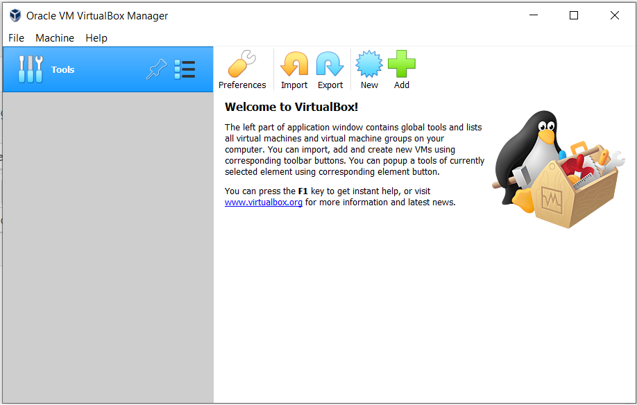
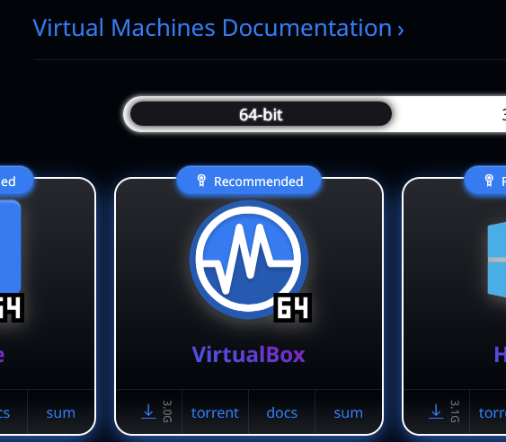
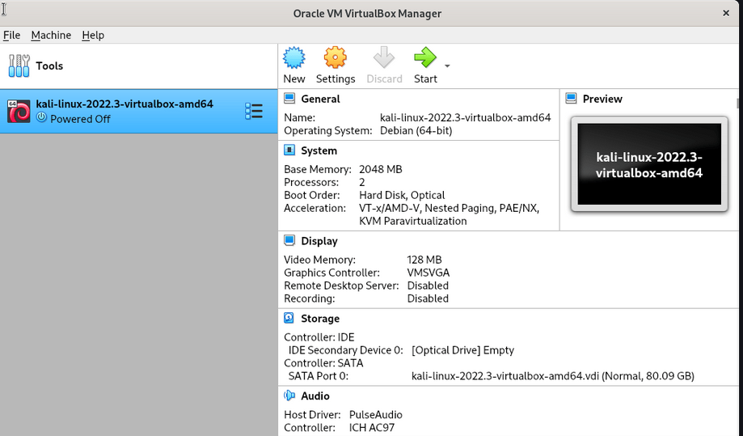
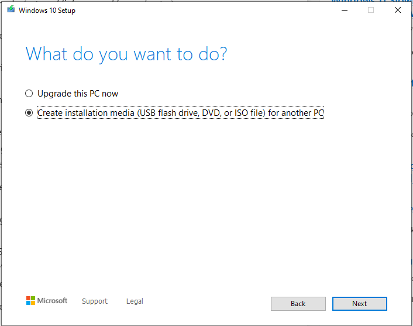
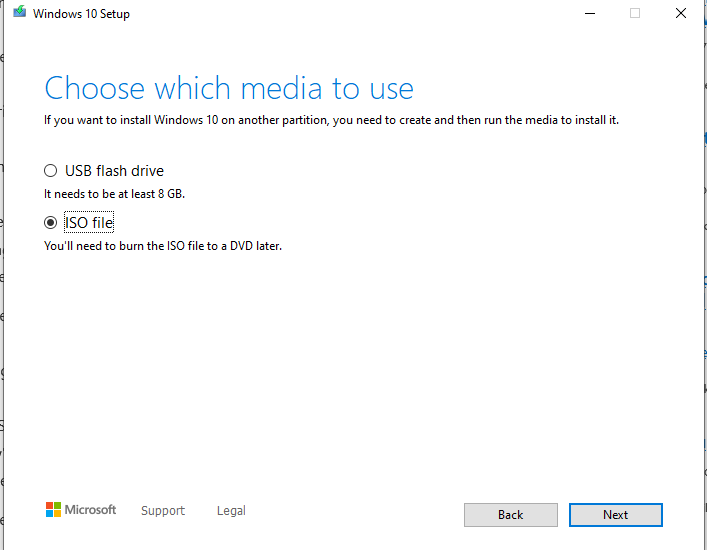
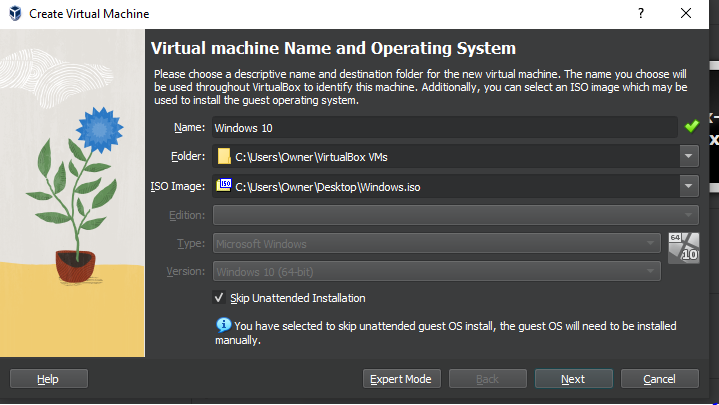
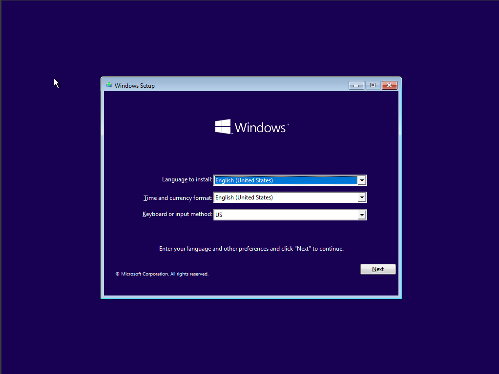
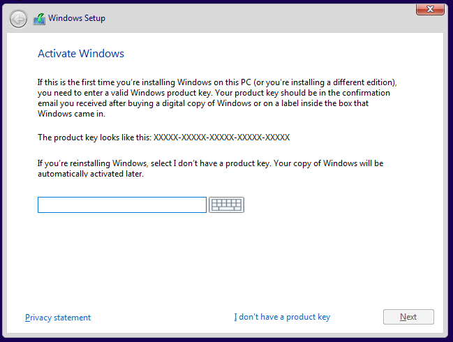
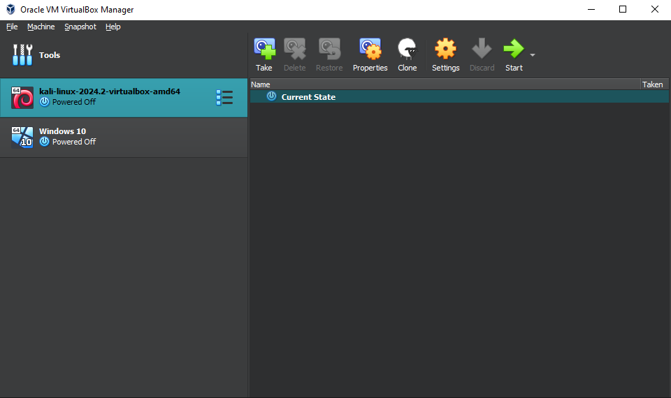
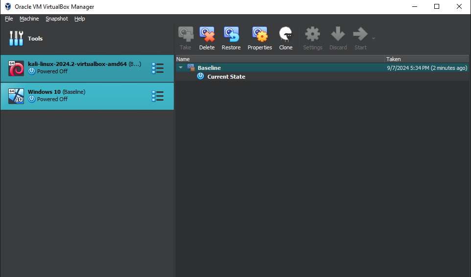

# Basic Home Lab

This is a virtualized environment utilizing VirtualBox with a Kali Linux VM and Windows 10 VM.

## Download and Install VirtualBox

Go to https://www.virtualbox.org/wiki/Downloads and download the package applicable to your machine. 

Run the installer and the installation wizard should appear. 

Click next a few times and finish the installation. 

When you open VirtualBox the following window will populate:

## Download and Install Kali Linux in VirtualBox

Go to https://www.kali.org/get-kali/#kali-virtual-machines and download the Kali Linux VirtualBox image.

Open your Downloads folder, right click and extract the VirtualBox image. 

In VirtualBox click on the Add button and navigate to the Downloads folder where you extracted the image and open it. 

The Kali Linux VM should be listed VirtualBox.

## Download and Install Windows 10 in VirtualBox

Go to https://www.microsoft.com/en-us/software-download/windows10 and under Create Windows 10 Installation Media click download.

Run the MediaCreationTool file and click yes to to allow the app to make changes.

Next, agree to the terms of service then select the Create Installation Media option. 

Click next a few times until you get to the Choose Which Media To Use page and select ISO file.

Open VirtualBox and click on the New button. 

Name the VM and in the ISO Image field click the drop down menu and navigate to Windows ISO image we just created.

Click next and allocate 4 GB for RAM, leave Hard disk as VDI, and enter 50GB for the virtual hard disk size.

Create and open the Windows 10 VM in VirtualBox to set up username and password and complete the installation.

During the Windows setup, the wizard will ask for a product key. Select I don't have a product key option at the bottom.

## Create Snapshot

Before testing on any VM it's best practice to create a snapshot. Snapshots allow us to revert our VM to a specific condition, so if malware is executed and breaks something you can start from the snapshot and everthing is good to go. 

To create a snapshot click on the stacked line icons next to the VM and select Snapshot.

Click on Take and name the snapshot.

Follow the same process for the other VM.

If malware was executed and the VM needs to be restored, select the snapshot and click on Restore.

## Network Configuration

There are several different types of network configurations that could be used depending on the type of testing being done.

### NAT

NAT is the default networking mode in VirtualBox. In NAT mode, the VM operates in a private network and is assigned a virtual IP. The VMs configured with NAT are isolated and would not be able to communicate with other VMs.

### NAT Network

NAT Network is similar to NAT, but it provides a shared network between VMs, meaning any VM with this configuration can communicate with each other. To create a NAT Network select Tools then NAT Network, and hit Create. Name NAT Network and enter a IPv4 address.

### Internal Network 

This type of configuration is useful for analyzing malware being that the VMs are connected to each other and completely isolated from the outside/external network. For this configuration we will need to statically assign an IP to each VM or setup a DHCP server. 

I will cover this in another lab. 

## Conclusion 

I've built a few home labs before, but this one is the most simplistic and will serve as a good base for future projects. 

[back](./)
